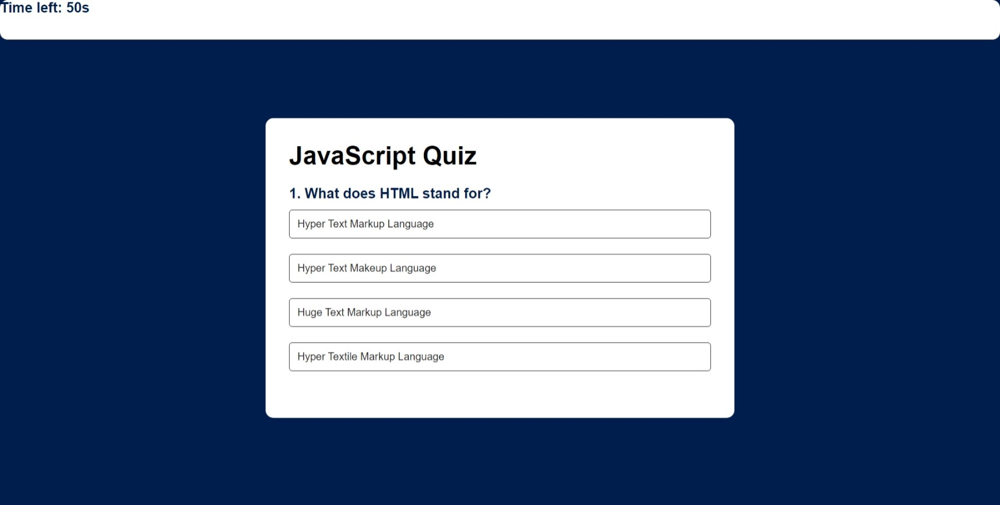

# 04 Web APIs: Code Quiz

## Task
This project was tasked with creating a javascript based quiz game that dynamically updates the page. The user will press begin button which initializes the quiz with a 60 second timer. Green is correct and red is for incorrect which shows simultaneously as user chooses answer. At the end of the game, the user is prompted to enter initials to be stored in the highscores page. 

## ScreenShots

The following animation demonstrates the application functionality:

## Grading Requirements

## Links

https://github.com/dponsones/jsQuiz.git

https://dponsones.github.io/jsQuiz/